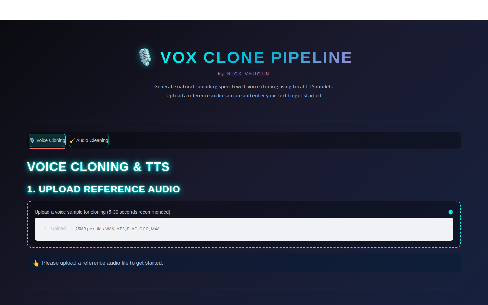
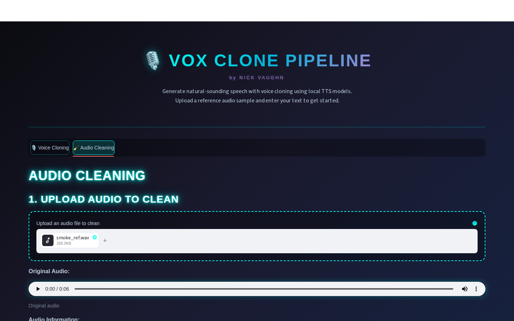
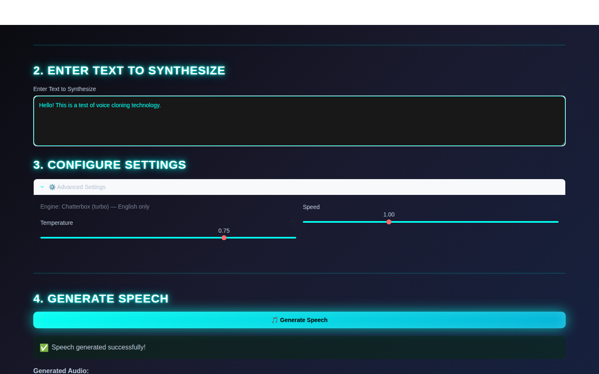

# 🎙️ Vox Clone Pipeline

A clean, modular Streamlit application for local zero-shot text-to-speech (TTS) voice cloning. Runs locally on Apple Silicon GPU (MPS), CUDA, or CPU, with a focus on code quality and maintainability.

## Screenshots

| Voice Cloning | Audio Cleaning |
|---|---|
|  |  |



## Features

- 🎯 **Zero-Shot Voice Cloning**: Clone any voice from a short audio sample
- 🧹 **Audio Cleaning**: Noise reduction, normalization, and silence trimming
- 🎵 **Text-to-Speech**: Generate natural-sounding speech in multiple languages
- 💻 **Runs Locally**: Uses the Apple Silicon GPU automatically; no dedicated GPU required
- 🏗️ **Clean Architecture**: Modular OOP design with separation of concerns
- 🎨 **User-Friendly UI**: Intuitive Streamlit interface

## Architecture

```
vox-clone-pipeline/
├── audio/              # Audio processing and I/O
│   ├── __init__.py
│   ├── io_handler.py   # Audio file loading and saving
│   └── processor.py    # Audio cleaning and processing
├── tts/                # TTS engine and voice cloning
│   ├── __init__.py
│   ├── engine.py       # TTS model interface
│   └── voice_cloner.py # Voice cloning operations
├── orchestration/      # Business logic orchestration
│   ├── __init__.py
│   └── tts_orchestrator.py  # Coordinates audio and TTS operations
├── app/                # Streamlit UI components
│   ├── __init__.py
│   ├── ui_components.py # Reusable UI components
│   └── pages.py        # Application pages
├── core/               # Configuration and utilities
│   ├── __init__.py
│   ├── config.py       # Application configuration
│   └── utils.py        # Shared utilities
├── tests/              # Unit tests
│   ├── __init__.py
│   ├── test_core.py
│   └── test_audio.py
├── streamlit_app.py    # Main application entry point
├── requirements.txt    # Python dependencies
└── pyproject.toml      # Project configuration
```

## Installation

### Prerequisites

- Python 3.10-3.12
- macOS (optimized for, but should work on other platforms)
- ~2GB disk space for TTS models
- 8 GB RAM minimum (Chatterbox Turbo); 16 GB+ recommended for the standard variant

### Setup

1. **Clone the repository**:
   ```bash
   git clone https://github.com/EngineerNV/vox-clone-pipeline.git
   cd vox-clone-pipeline
   ```

2. **Create a virtual environment**:
   ```bash
   python3 -m venv venv
   source venv/bin/activate  # On macOS/Linux
   ```

3. **Install dependencies**:
   ```bash
   pip install -r requirements.txt
   ```

4. **Download TTS models** (automatic on first run):
   The Chatterbox Turbo model (~2GB) will be downloaded automatically when you first run the app.

## Usage

### Running the Application

```bash
streamlit run streamlit_app.py
```

The app will open in your default browser at `http://localhost:8501`.

### Voice Cloning Workflow

1. **Upload Reference Audio**: Upload a 5-30 second audio sample of the voice you want to clone
2. **Enter Text**: Type or paste the text you want to synthesize
3. **Configure Settings**: Adjust language, temperature, and speed (optional)
4. **Generate**: Click "Generate Speech" and wait for processing
5. **Download**: Save the generated audio file

### Audio Cleaning Workflow

1. **Upload Audio**: Upload an audio file to clean
2. **Select Operations**: Choose noise reduction, normalization, and/or silence trimming
3. **Clean**: Process the audio
4. **Download**: Save the cleaned audio file

## Configuration

Configuration can be customized via environment variables or by editing `core/config.py`:

```python
# Audio settings
AUDIO_SAMPLE_RATE=22050      # Sample rate for processing
AUDIO_MAX_DURATION=30         # Maximum audio duration (seconds)

# TTS settings
TTS_ENGINE=chatterbox        # "chatterbox" (default) or "xtts" (legacy, separate venv)
CHATTERBOX_VARIANT=turbo     # "turbo" (~2-3 GB) or "standard" (~4-5 GB)
TTS_DEVICE=auto              # "auto" picks cuda > mps (Apple Silicon GPU) > cpu
TTS_MODEL_NAME=tts_models/multilingual/multi-dataset/xtts_v2  # XTTS engine only
TTS_LANGUAGE=en              # Default language
```

### Apple Silicon GPU (MPS)

On M-series Macs the app uses the GPU automatically via PyTorch's MPS
backend (`TTS_DEVICE=auto`). Apple Silicon has unified memory — the GPU
shares system RAM, so there is no separate VRAM to configure. Chatterbox
Turbo peaks at ~2-3 GB; the standard variant at ~4-5 GB. If you hit an
MPS-related error, set `TTS_DEVICE=cpu` as a fallback.

## Development

### Code Quality Tools

The project uses modern Python tooling:

- **ruff**: Fast Python linter and formatter
- **mypy**: Static type checking
- **pytest**: Testing framework

### Running Tests

```bash
# Run all tests
pytest

# Run with coverage
pytest --cov=. --cov-report=html

# Run specific test file
pytest tests/test_audio.py
```

### Linting and Type Checking

```bash
# Run ruff linter
ruff check .

# Run ruff formatter
ruff format .

# Run mypy type checker
mypy .
```

### Project Structure Principles

- **Separation of Concerns**: Each module has a clear, single responsibility
- **Dependency Injection**: Services receive dependencies rather than creating them
- **Configuration Management**: Centralized configuration with environment override support
- **Type Hints**: Full type annotations for better IDE support and error detection
- **Clean Code**: Following PEP 8 and modern Python best practices

## Supported Features

### Audio Formats
- WAV, MP3, FLAC, OGG, M4A

### Languages
- **Chatterbox** (default engine): English
- **XTTS v2** (legacy engine): English, Spanish, French, German, Italian, Portuguese, Polish, Turkish, Russian, Dutch, Czech, Arabic, Chinese (Simplified)

### TTS Models
- **Chatterbox (Resemble AI)** — default: MIT-licensed zero-shot voice cloning with
  strong accent preservation. Two variants: `turbo` (350M params, fast, lean) and
  `standard` (~0.5B params, adds exaggeration/CFG expressiveness controls). Outputs
  carry a PerTh audio watermark.
- **Coqui XTTS v2** — legacy: multilingual zero-shot voice cloning. Known to drift
  toward a British/RP accent with short or heavily-processed reference clips. Its
  dependency stack conflicts with Chatterbox, so it lives in its own virtualenv
  (`requirements-xtts.txt`).

## Performance

- **Local Inference**: Apple Silicon GPU (MPS) used automatically; CPU fallback available
- **Generation Time**: ~10-30 seconds for short text on modern hardware
- **Memory Usage**: ~2-4GB RAM during generation

## Troubleshooting

### Common Issues

**"Model not found" error**:
- Ensure you have an active internet connection on first run
- The Chatterbox model (~2GB) will be downloaded automatically

**"Audio duration invalid" warning**:
- Reference audio should be 0.5-30 seconds
- Use the audio cleaning feature to trim silence

**Slow generation**:
- This is normal on CPU-only systems
- Consider shorter text or simpler models for faster generation

**Import errors**:
- Ensure all dependencies are installed: `pip install -r requirements.txt`
- Check Python version compatibility (3.10-3.12)

## Contributing

Contributions are welcome! Please:

1. Fork the repository
2. Create a feature branch
3. Make your changes with tests
4. Run linters and tests
5. Submit a pull request

## License

MIT License - see LICENSE file for details

## Acknowledgments

- [Chatterbox (Resemble AI)](https://github.com/resemble-ai/chatterbox) - Default TTS engine
- [Coqui TTS](https://github.com/coqui-ai/TTS) - Legacy XTTS engine
- [Streamlit](https://streamlit.io/) - Web application framework
- Community contributors and testers

## Support

For issues, questions, or suggestions:
- Open an issue on GitHub
- Check existing issues for solutions

---

**Note**: This is a fully local application. No data is sent to external servers. All processing happens on your machine.
